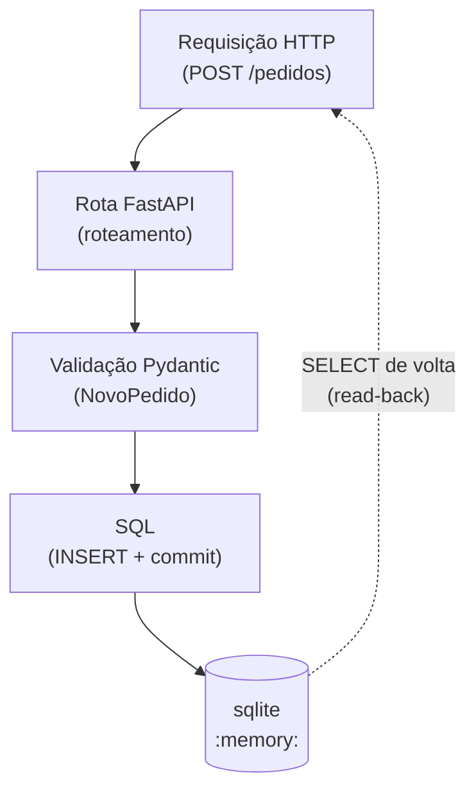
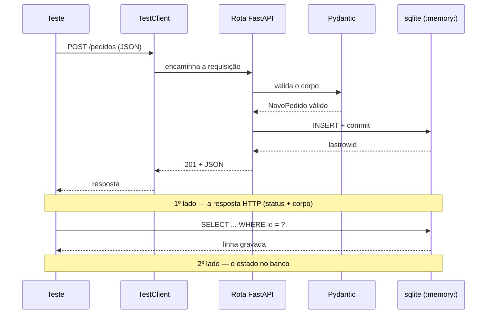
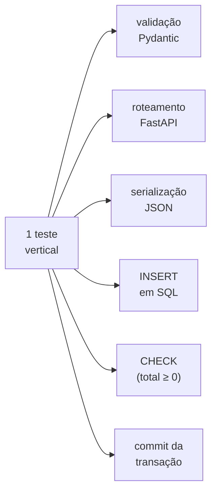

# Tutorial 30 — Integração ponta a ponta de API e Banco ⭐ (âncora da Sessão 8)

> Referência: Martin Fowler, "IntegrationTest" e "TestPyramid" (martinfowler.com);
> documentação FastAPI — TestClient; módulo `sqlite3`;
> Kent C. Dodds, "Write tests. Not too many. Mostly integration."

## 1. Contexto e Motivação

Os Tutoriais 28 e 29 isolaram, cada um, uma das duas colaborações que uma suíte de integração costuma cobrir. O 28 exercitou HTTP e serialização contra uma API cujo estado vivia num dicionário em memória, sem tocar banco nenhum. O 29 exercitou SQL e constraints contra um banco real, chamando as funções do repositório diretamente, sem passar por HTTP. Cada um provou que a sua camada funciona. Nenhum dos dois provou que as camadas funcionam juntas.

É essa a lacuna que um teste de integração vertical fecha. Uma requisição percorre a mesma pilha que percorreria em produção — a rota do FastAPI, a validação do Pydantic, o SQL contra o banco — até o dado ser persistido, e o teste confirma que ele chegou lá.

A tabela abaixo mostra por que os dois tutoriais anteriores, sozinhos, deixam um vão:

| Tutorial | O que exercita | O que não toca |
|---|---|---|
| 28 | HTTP, roteamento, serialização | o banco (estado em memória) |
| 29 | SQL, constraints, transação | HTTP (chama o repositório direto) |
| **30** | **HTTP → validação → SQL → banco, numa passada** | nada dentro do backend |

O termo "vertical" contrasta com a abordagem horizontal dos dois tutoriais anteriores. Cada um deles cobria uma faixa da pilha de ponta a ponta na horizontal — o 28 na camada de cima, o 29 na de baixo. O teste vertical corta a pilha de cima a baixo, atravessando todas as camadas de uma vez:



A única simplificação é usar o SQLite em memória no lugar do banco de produção, a mesma escolha já justificada no Tutorial 29.

Este é o tutorial-âncora da Sessão 8, e a aplicação sob teste, em [`exemplos/app.py`](exemplos/app.py), reúne os dois tutoriais anteriores. É a API de pedidos do Tutorial 28, agora com uma diferença de projeto que torna o teste vertical possível: a função `criar_app(conn: sqlite3.Connection)` recebe a conexão do banco por parâmetro, em vez de criá-la internamente.

```python
# exemplos/app.py — a conexão entra por parâmetro (injeção de dependência)
def criar_app(conn: sqlite3.Connection) -> FastAPI:
    criar_schema(conn)
    conn.row_factory = sqlite3.Row
    app = FastAPI()

    @app.post("/pedidos", status_code=201)
    def criar_pedido(novo: NovoPedido) -> dict:
        total = sum(i.quantidade * i.preco_unitario for i in novo.itens)
        cur = conn.execute(
            "INSERT INTO pedidos (cliente, total) VALUES (?, ?)",
            (novo.cliente, total),
        )
        conn.commit()
        return {"id": cur.lastrowid, ...}
    ...
    return app
```

Essa injeção permite ao teste passar o seu próprio `sqlite3.connect(":memory:")` e, depois da chamada HTTP, consultar esse mesmo banco para ver o que a requisição gravou — exatamente como o Tutorial 29 fazia com o repositório.

> **Nota:** injetar a conexão não é um detalhe de estilo. Se `criar_app` abrisse a própria conexão lá dentro, o teste não teria como alcançar o banco que a rota usa — sobraria confiar na resposta HTTP e torcer. Receber a conexão por parâmetro é o que dá ao teste as **duas pontas**: o mesmo objeto que a rota grava é o que o teste relê.

---

## 2. Conceito Central

### (a) Onde o teste vertical começa e onde ele para

Uma requisição de produção, ao chegar nessa API, passa por uma sequência: o FastAPI identifica a rota, o Pydantic valida o corpo, o código da rota monta o SQL, o banco executa e confirma a transação. Um teste vertical percorre essa mesma sequência inteira, num único processo, e verifica o resultado nas duas pontas — a resposta que voltou e o estado que ficou no banco.

O diagrama abaixo segue uma requisição do teste até o banco e de volta, e marca os dois pontos onde a verificação acontece:



Há uma fronteira a respeitar, e ela separa este tutorial dos próximos. Vertical, aqui, significa a pilha de backend completa: API, validação, SQL, banco. Não inclui a interface pela qual o usuário final interage. Um teste ponta a ponta de verdade — o assunto da Sessão 9 — dirige a aplicação pelo navegador ou pelo app, sobe processos reais e paga em lentidão e instabilidade o preço dessa fidelidade. Este tutorial fica deliberadamente aquém disso: é o maior nível de confiança que se compra sem sair da camada de integração. A fronteira exata, o ponto em que o teste passa a ser E2E, volta nos Tutoriais 31 e 32.

### (b) As respostas da API: o que cada status significa

Antes de verificar os dois lados, vale entender o que a API responde em cada situação, porque o status HTTP é a primeira coisa que o teste confere. Esta API usa quatro:

| Status | Nome | Quando acontece nesta API |
|---|---|---|
| **201** | Created | `POST /pedidos` com corpo válido — o pedido foi criado |
| **200** | OK | `GET /pedidos/{id}` de um pedido que existe |
| **404** | Not Found | `GET /pedidos/{id}` de um id que não existe |
| **422** | Unprocessable Entity | corpo reprovado na validação (quantidade ≤ 0, lista de itens vazia) |

O 422 é o que o Pydantic devolve sozinho, antes de o código da rota rodar. Quando o corpo chega, o FastAPI tenta construir o modelo `NovoPedido`; se um `field_validator` rejeitar o dado — como o `_pos`, que exige `quantidade > 0` —, a requisição para ali e volta 422, sem tocar o banco. O teste de validação não precisa de mock: ele manda um corpo inválido e confere o 422.

> **Nota:** validação Pydantic é a checagem que o FastAPI faz do corpo da requisição contra o modelo declarado. Tipos errados, campos faltando, valores fora da regra — tudo isso vira 422 automaticamente. É por isso que a rota `criar_pedido` recebe um `NovoPedido` já validado, e não um dicionário cru: quando o código roda, o dado já passou pela porteira.

### (c) Verificar os dois lados

O erro mais comum ao "testar a pilha inteira" é parar na primeira confirmação que aparece, o código de status da resposta, e nunca voltar para confirmar o efeito que a pilha deveria ter produzido. São duas perguntas distintas, e cada uma se responde num lugar diferente:

- A API respondeu corretamente? A resposta está em `resposta.status_code` e em `resposta.json()`.
- O efeito realmente aconteceu? A resposta está em consultar o banco de volta, com `conn.execute(...)`.

A distinção importa porque um bug de persistência real — um commit esquecido, uma coluna errada, um `UPDATE` que não roda — pode devolver uma resposta HTTP impecável e mesmo assim não ter gravado nada. Isso acontece quando o código da rota monta o dicionário de retorno por conta própria, sem reler o banco. A resposta reflete a intenção do código, não o estado do banco. Só a segunda pergunta expõe o bug.

> **Atenção:** o caso clássico é o `conn.commit()` esquecido. Sem o commit, o `INSERT` fica pendente na transação da conexão; a rota ainda enxerga o dado e devolve 201 com o corpo certo, porque lê da própria transação aberta. Mas o dado nunca é confirmado. Um teste que confere só a resposta fica verde. Só o `SELECT` de volta — que, dependendo da configuração, enxerga o estado confirmado — pega a falta.

O par abaixo, de [`exemplos/integracao_bons.py`](exemplos/integracao_bons.py), mostra a diferença. O primeiro teste para na resposta; o segundo relê o banco:

```python
# ❌ Confere só a resposta HTTP — nunca relê o banco
def test_pagar_pedido_muda_status_para_pago(contexto):
    cliente, conn = contexto
    criado = cliente.post("/pedidos", json={...}).json()
    resposta = cliente.post(f"/pedidos/{criado['id']}/pagar")
    assert resposta.status_code == 200
    assert resposta.json()["status"] == "pago"   # não prova que foi persistido

# ✅ Confere os dois lados: a resposta HTTP e o estado gravado no banco
def test_pagar_pedido_persiste_status_pago_no_banco(contexto):
    cliente, conn = contexto
    criado = cliente.post("/pedidos", json={...}).json()
    resposta = cliente.post(f"/pedidos/{criado['id']}/pagar")
    assert resposta.status_code == 200
    assert resposta.json()["status"] == "pago"
    linha = conn.execute("SELECT status FROM pedidos WHERE id = ?",
                         (criado["id"],)).fetchone()
    assert tuple(linha) == ("pago",)              # prova que foi persistido
```

O teste real de criação, em [`exemplos/integracao_bons.py`](exemplos/integracao_bons.py), aplica o mesmo padrão à rota `POST /pedidos`:

```python
def test_post_pedido_persiste_no_banco(contexto):
    cliente, conn = contexto
    resposta = cliente.post("/pedidos", json={
        "cliente": "Ana",
        "itens": [{"produto": "Livro", "quantidade": 3, "preco_unitario": 10.0}],
    })
    assert resposta.status_code == 201            # 1º lado: a resposta
    pedido_id = resposta.json()["id"]
    linha = conn.execute("SELECT cliente, total FROM pedidos WHERE id = ?",
                         (pedido_id,)).fetchone()
    assert tuple(linha) == ("Ana", 30.0)          # 2º lado: o estado no banco
```

Repare que o teste confere o `total` gravado (`30.0`), não só que a linha existe. O total nasce de um cálculo da rota — `3 × 10.0` —, então reler o banco também prova que a aritmética do backend rodou de ponta a ponta.

### (d) A fixture: um banco novo por teste

A verificação dos dois lados depende de uma coisa: o teste e a rota tocarem a **mesma** conexão, e cada teste começar de um banco limpo. Isso é trabalho da fixture, em [`exemplos/integracao_bons.py`](exemplos/integracao_bons.py):

```python
@pytest.fixture
def contexto():
    conn = sqlite3.connect(":memory:", check_same_thread=False)
    cliente = TestClient(criar_app(conn))
    yield cliente, conn
    conn.close()
```

Três decisões cabem aqui. A conexão é `:memory:`, então cada teste tem um banco próprio que nasce e morre com ele — nenhum estado vaza de um teste para o outro. A mesma `conn` vai para o `criar_app` **e** volta no `yield`, o que dá ao teste o objeto que a rota usa. E o `conn.close()` depois do `yield` desmonta tudo ao fim.

> **Nota:** o `check_same_thread=False` costuma assustar quem já apanhou de concorrência com sqlite. Aqui ele é seguro. O `TestClient` executa os handlers síncronos numa worker thread do pool do anyio, diferente da thread do teste que criou a conexão. As chamadas continuam sequenciais — nunca concorrentes —, então relaxar a checagem de afinidade de thread do sqlite é só isso, e não sinal de acesso paralelo ao banco.

### (e) A integração vertical falsa: o que não se deve mockar

Existe um anti-padrão específico deste nível de teste, e ele é o mais difícil de flagrar em uma revisão de código. Consiste em mockar justamente a camada que o teste se propõe a exercitar. Em [`exemplos/integracao_ruins.py`](exemplos/integracao_ruins.py), o teste injeta um `MagicMock()` no lugar da conexão real, através da mesma `criar_app(conn)`:

```python
# ❌ Integração vertical falsa: o banco é o próprio dublê
def test_post_pedido_com_banco_mockado():
    conn_mock = MagicMock()
    conn_mock.execute.return_value.lastrowid = 1
    cliente = TestClient(criar_app(conn_mock))
    resposta = cliente.post("/pedidos", json={...})
    assert resposta.status_code == 201     # verde, mas nenhum SQL rodou
```

A armadilha está na aparência. A estrutura desse teste é idêntica à do teste bom — a mesma fixture, o mesmo `TestClient`, a mesma factory, o mesmo formato de chamada. Só a conexão foi trocada por um objeto que devolve exatamente o que foi programado para devolver. O teste parece atravessar HTTP, aplicação e banco, mas o banco nunca é tocado. É a mesma tautologia do Tutorial 29 — "eu disse que o mock devolve isso" —, agora escondida atrás da fachada de um teste de integração.

A regra prática é direta: no nível vertical, a camada que está sob teste não pode ser mockada. Mocká-la devolve a suíte ao nível de unidade, mas com a aparência de integração — e é essa aparência que faz o problema passar despercebido em revisão.

> **Dica:** para flagrar uma integração vertical falsa numa revisão, procure por `MagicMock`, `patch` ou qualquer dublê no caminho entre a requisição e o banco. Se a conexão, o repositório ou o próprio banco viraram mock, o teste não é de integração — só se veste como um. A pergunta a fazer no PR: "o que esse teste ainda prova depois que a peça real foi substituída?"

### (f) A "trophy" de testes, revisitada

A "trophy" de Kent C. Dodds, citada na Sessão 7 e no Tutorial 28, defende investir a maior parte do esforço de teste na camada de integração, e não na de unidade. Este tutorial é o exemplo mais concreto do porquê. Um único teste vertical, o `test_post_pedido_persiste_no_banco`, exercita numa só passada seis pontos de risco:



Cobrir a mesma superfície apenas com testes de unidade exigiria mockar cada colaboração — validação, roteamento, repositório — em separado, multiplicando o número de testes sem multiplicar a confiança na mesma proporção. Cada mock reintroduz a pergunta da seção (e): isso prova que a peça real se comporta assim, ou apenas que eu programei o dublê para devolver isso?

---

## 3. Ferramentas Modernas por Linguagem

| Linguagem | Framework | Instalar | Executar |
|---|---|---|---|
| Python | **pytest + FastAPI TestClient + `sqlite3`** | `pip install -r requirements.txt` | `pytest -v` |
| PHP | **PHPUnit 11 + Guzzle + PDO/SQLite** (contra servidor real) | `composer install` | `vendor/bin/phpunit` |
| TypeScript | **Vitest + supertest + better-sqlite3** | `npm install` | `npx vitest run` |
| ADVPL/TLPP | **PROBAT + FWRest + DBAccess/TCQuery** | já incluso no ambiente TOTVS (tlppCore) | executar via AppServer com o endpoint publicado |

Os arquivos [`equivalente.php`](exemplos/equivalente.php), [`equivalente.ts`](exemplos/equivalente.ts) e [`equivalente.tlpp`](exemplos/equivalente.tlpp), com os pares em `exercicios/`, trazem o mesmo padrão vertical, bom e ruim, na sintaxe idiomática de cada linguagem. Eles servem de referência, não de suíte executável neste workshop: PHP e Vitest não estão instalados neste ambiente, e o PROBAT depende de um AppServer TOTVS no ar. A convenção é a mesma da Sessão 7 e dos Tutoriais 28 e 29 — o Python é a implementação que você executa.

```bash
# Rodar a suíte de integração (Python)
cd exemplos
pytest integracao_bons.py -v
```

> **Nota:** o arquivo se chama `integracao_bons.py`, e não `test_integracao.py`. O padrão de descoberta automática do pytest (`test_*.py`) não casa com esse nome de propósito — assim os dois arquivos, o bom e o ruim, ficam lado a lado no diretório sem que um `pytest` sem argumento tente rodar os dois. Por isso o comando nomeia o arquivo explicitamente.

---

## 4. Exercício

O arquivo [`exercicios/exercicio.py`](exercicios/exercicio.py), e os equivalentes `.php`, `.ts` e `.tlpp`, trazem um teste sobre a rota `POST /pedidos/{id}/pagar` — adicionada à aplicação do exercício especificamente para este tutorial — com o mesmo problema estrutural de [`exemplos/integracao_ruins.py`](exemplos/integracao_ruins.py), o anti-padrão de verificar só um lado:

O teste confirma `resposta.status_code == 200` e `resposta.json()["status"] == "pago"`, mas nunca relê o banco. Um bug em `pagar_pedido()` que devolvesse a resposta certa sem de fato persistir o `UPDATE`, ou sem confirmar a transação, passaria despercebido.

A [`exercicios/app.py`](exercicios/app.py) é uma cópia local da aplicação, idêntica à de `exemplos/`, com a rota adicional `POST /pedidos/{id}/pagar`. Como o repositório não permite que um arquivo importe de outro diretório, a aplicação é replicada aqui para que o exercício rode por conta própria.

**Etapas:**

1. Execute o teste como está. Ele passa — o problema é de estrutura, não de execução.
2. Identifique o problema: o teste verifica apenas a resposta HTTP.
3. Refatore seguindo [`exemplos/integracao_bons.py`](exemplos/integracao_bons.py): depois de chamar a rota, releia o pedido com `conn.execute(...)` e confirme que o status `"pago"` está gravado no banco, e não somente presente na resposta.
4. Compare o resultado com [`exercicios/gabarito.py`](exercicios/gabarito.py), ou com o gabarito na sua linguagem.

```bash
# Rodar o exercício e o gabarito (Python)
cd exercicios
pytest exercicio.py -v
pytest gabarito.py -v
```

> **Dica:** para provar a si mesmo que o teste do gabarito realmente pega o bug, sabote a rota `pagar_pedido()` na `exercicios/app.py`: comente o `conn.commit()` ou troque o `UPDATE` por um `SELECT` inócuo. O teste ruim continua verde; o teste do gabarito, que relê o banco, fica vermelho. Depois desfaça a sabotagem.

---

## 5. Checklist

- [ ] O teste percorre a pilha real (rota → validação → SQL → banco), sem mockar a colaboração que está sob teste?
- [ ] Cada teste verifica os dois lados — a resposta HTTP, com status e corpo, e o estado gravado, relendo o banco?
- [ ] A conexão é injetada via `criar_app(conn)` e criada nova (`:memory:`) a cada teste, sem estado vazando entre testes?
- [ ] Nenhuma camada dentro do escopo do teste está mockada? (Se o banco estivesse, o teste teria voltado a ser de unidade, disfarçado de integração.)
- [ ] O teste sabe onde parar — permanece no nível de backend vertical e não sobe navegador ou interface, o que já seria E2E, assunto dos Tutoriais 31 e 32?

---

## 6. Referências

- **FOWLER, Martin.** "IntegrationTest" (bliki).
  `https://martinfowler.com/bliki/IntegrationTest.html`
  Citado nos Tutoriais 28 e 29 — aqui, as duas colaborações, HTTP e persistência, são exercitadas juntas na mesma suíte.

- **FOWLER, Martin.** "TestPyramid" (bliki).
  `https://martinfowler.com/bliki/TestPyramid.html`
  A camada de integração deste tutorial fica entre a unidade (Sessão 7) e o E2E (Sessão 9) — o ponto de maior retorno por esforço, segundo o modelo.

- **FastAPI.** "Testing" — documentação oficial sobre `TestClient`.
  `https://fastapi.tiangolo.com/tutorial/testing/`
  Base do padrão de teste em memória usado neste tutorial, agora combinado com a persistência real em sqlite.

- **Python.** Documentação oficial do módulo `sqlite3`.
  `https://docs.python.org/3/library/sqlite3.html`
  Referência da API usada em `app.py`, incluindo `row_factory`, `Connection.execute` e o comportamento das conexões `:memory:` injetadas.

- **DODDS, Kent C.** "Write tests. Not too many. Mostly integration." (blog).
  Citada no Tutorial 28 — este é o exemplo mais direto do argumento: um teste vertical cobre, numa passada, mais superfície de risco do que várias unidades mockadas cobririam em separado, como discute a seção 2(f).
