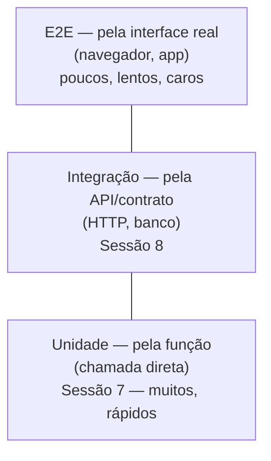
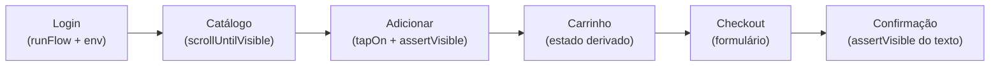
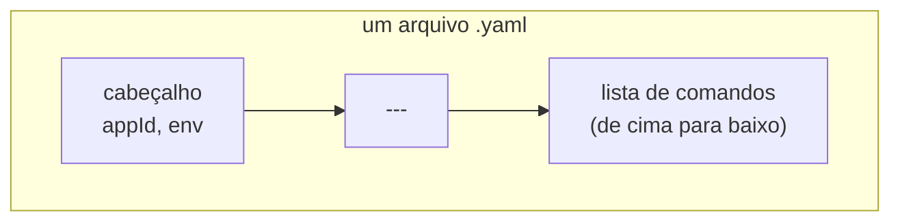
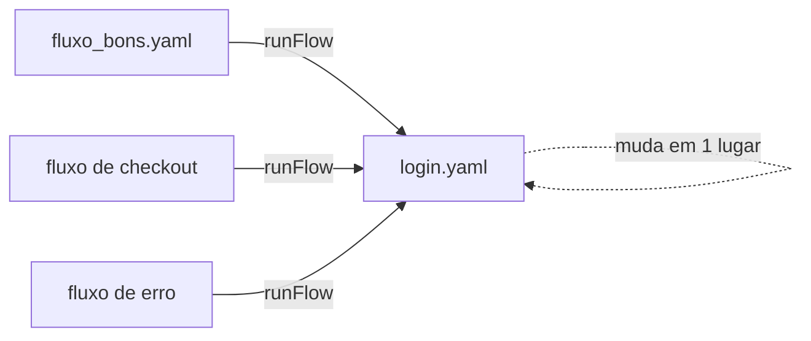

# Tutorial 31 — E2E Web com Maestro

> Referência: Martin Fowler, "TestPyramid" (martinfowler.com); Maestro — documentação oficial (maestro.mobile.dev)

## 1. Contexto e Motivação

A Sessão 7 apresentou a pirâmide de testes e colocou o teste end-to-end no topo: poucos, lentos, caros, e ainda assim insubstituíveis para uma pergunta que nenhum teste de unidade ou de integração responde sozinho — a pessoa que usa o produto consegue, de fato, percorrer o fluxo até o fim pela interface real?

Cada andar da pirâmide verifica o sistema por um ângulo diferente, e é útil ver os três lado a lado antes de subir ao topo:



Um teste de unidade chama uma função e confere o retorno. Um teste de integração, como os da Sessão 8, envia uma requisição HTTP e examina a resposta. Ambos verificam o sistema por dentro, a partir do código ou do contrato de API. Nenhum dos dois abre uma página no navegador, faz login, adiciona um item ao carrinho e confirma o que aparece na tela. É esse último passo que separa "o backend calcula o total corretamente" de "o cliente consegue comprar".

O teste end-to-end percorre esse caminho pela interface, sem atalho para dentro do código, e por isso encontra uma categoria de defeito que os andares de baixo não alcançam: o botão que existe no HTML mas não dispara o evento certo, o texto que o JavaScript esquece de atualizar, o elemento que carrega tarde demais, a tela que só aparece depois do login.

Este tutorial usa o **Maestro**, uma ferramenta que descreve o teste como um arquivo YAML declarativo em vez de código imperativo, e o aplica a uma aplicação real: o **[saucedemo.com](https://www.saucedemo.com)**, a loja de demonstração da Sauce Labs, feita justamente para praticar automação. Ela tem o que uma aplicação de verdade tem e um exemplo de brinquedo não tem — login obrigatório, um catálogo com vários produtos e rolagem, um carrinho que guarda estado, e um checkout de várias etapas com formulário. São esses elementos que exigem os recursos do Maestro que este tutorial cobre.

O fluxo de compra que os exemplos exercitam passa por estas etapas, cada uma cobrindo um recurso da ferramenta:



O Tutorial 32 leva a mesma ferramenta ao mobile; o 33 fecha a Sessão 9 com o K6, medindo carga em vez de interface.

---

## 2. Conceito Central

### (a) O flow e o seletor

Um **flow** é a unidade de trabalho do Maestro: um arquivo YAML que descreve, passo a passo, o que uma pessoa faria na aplicação — abrir a tela, tocar em um botão, digitar, verificar que algo apareceu. O arquivo tem duas partes separadas pela marcação `---`: um cabeçalho, com o campo `appId` (o identificador do app mobile ou, no caso web, a URL a abrir), e a lista de comandos, executados de cima para baixo.



Para agir sobre um elemento, o Maestro precisa apontar para ele. Essa forma de apontar chama-se **seletor**, e a escolha do seletor decide se o fluxo é estável. Um seletor **estável** identifica o elemento por algo que descreve o que ele é e não muda com o layout — um `id`, um texto visível, uma propriedade de acessibilidade. Um seletor **frágil** identifica pela posição na tela, como a coordenada `point: "90%, 45%"`, que só acerta o alvo na resolução exata em que alguém a mediu.

```yaml
# ❌ Frágil — depende de onde o elemento está
- tapOn:
    point: "90%, 45%"

# ✅ Estável — depende do que o elemento é
- tapOn:
    id: "add-to-cart-sauce-labs-backpack"
```

> **Atenção:** o seletor por coordenada é perigoso porque ele **não falha**. Um `id` errado quebra o fluxo na hora e você conserta. Uma coordenada que aponta para o lugar errado clica no vazio, ou pior, no botão vizinho, e o fluxo segue relatando sucesso. Um teste que passa clicando no lugar errado é pior que um teste que falha: ele dá confiança falsa. Por isso o seletor estável é a primeira decisão de um teste confiável.

### (b) Assertion em vez de espera fixa

Depois de uma ação, a tela leva um instante para reagir — geralmente milissegundos, mas o tempo varia com a máquina, a rede e o navegador. Há duas formas de lidar com essa espera. Uma **espera fixa** aposta em um número: pausar dois segundos e torcer para que já tenha carregado. Essa aposta erra dos dois lados — numa máquina lenta, dois segundos podem não bastar, e o teste falha por lentidão do ambiente, não por defeito; numa máquina rápida, os dois segundos são desperdício, multiplicado por cada passo de cada fluxo.

Uma **assertion** resolve o mesmo problema esperando pela condição, não pelo relógio. `assertVisible` tenta localizar o elemento até um tempo-limite e segue assim que o encontra. Ela é, ao mesmo tempo, a espera e a verificação: se o elemento nunca aparecer, o fluxo falha, e falha pela razão certa.

```yaml
# ✅ Espera exatamente até o elemento existir, e falha se ele nunca aparecer
- assertVisible:
    id: "inventory_container"
```

> **Dica:** pense na `assertVisible` como uma espera que também é um checkpoint. Ela não gasta o tempo-limite inteiro toda vez — sai no instante em que o elemento aparece. O `timeout` é só o teto, para o caso de o elemento nunca vir. Uma suíte cheia de `assertVisible` roda tão rápido quanto o app permite; uma suíte cheia de `sleep` roda na velocidade do maior chute que alguém deu.

### (c) Reaproveitar um fluxo: o subflow de login (`runFlow`)

Num app real, quase todo fluxo começa pela mesma coisa: o login. Copiar a sequência de login em cada arquivo de teste cria o mesmo problema que a duplicação cria em qualquer código — no dia em que a tela de login mudar, será preciso corrigir arquivo por arquivo, e uma das cópias vai ficar para trás.

O Maestro resolve isso com o comando `runFlow`, que executa outro arquivo de fluxo como um trecho do fluxo atual. A sequência de login vive em um único lugar — o [`exemplos/login.yaml`](exemplos/login.yaml) — e cada teste a invoca:



```yaml
# Em vez de repetir os passos de login, chama o subflow que os contém
- runFlow:
    file: login.yaml
```

O `login.yaml` não é um teste completo; é um pedaço reutilizável. Ele carrega a sequência inteira — abrir o app, preencher usuário e senha, tocar em entrar, confirmar que chegou ao catálogo:

```yaml
# exemplos/login.yaml — o subflow de login, invocado por runFlow
appId: "https://www.saucedemo.com"
env:
  USUARIO: standard_user
---
- launchApp:
    clearState: true
- tapOn:
    id: "user-name"
- inputText: "${USUARIO}"
- tapOn:
    id: "password"
- inputText: "secret_sauce"
- tapOn:
    id: "login-button"
- assertVisible:
    id: "inventory_container"  # confirma que o login levou ao catálogo
```

Quando a tela de login mudar, corrige-se esse arquivo, e todos os fluxos que o chamam continuam corretos.

### (d) Parametrizar um fluxo (`env`)

O saucedemo oferece usuários diferentes para simular situações diferentes — o `standard_user` (fluxo normal), o `locked_out_user` (conta bloqueada), o `problem_user` (interface com defeitos propositais). O mesmo roteiro de login serve a todos; só muda o nome do usuário. Repetir o subflow inteiro para cada um seria a duplicação de novo.

Um flow pode receber valores por parâmetro, através do bloco `env`. O `login.yaml` declara um valor padrão e usa a variável com a sintaxe `${...}`; quem chama pode sobrescrevê-la:

```yaml
# login.yaml — declara o parâmetro e o usa
env:
  USUARIO: standard_user
---
- inputText: "${USUARIO}"

# fluxo que chama — escolhe qual usuário exercitar
- runFlow:
    file: login.yaml
    env:
      USUARIO: problem_user
```

Com isso, o mesmo subflow cobre vários cenários de login sem nenhuma cópia — é o equivalente, em teste, a uma função que recebe argumentos.

### (e) Lidar com o opcional: condicionais (`when`)

Nem tudo aparece sempre. Um banner de cookies surge só na primeira visita; um aviso aparece apenas para certo usuário. Um passo incondicional que tenta fechar um banner que não está lá faz o fluxo falhar. O Maestro permite condicionar um trecho à presença (ou ausência) de um elemento, com `when`:

```yaml
# Só toca em "Aceitar" se o banner de cookies estiver visível
- runFlow:
    when:
      visible: "Aceitar cookies"
    commands:
      - tapOn: "Aceitar cookies"
```

O `when` aceita `visible` e `notVisible`. Ele protege o fluxo de variações de estado que não são o objeto do teste — um banner que às vezes aparece —, sem transformar cada uma delas em uma falha.

### (f) Alcançar o que está fora da tela (`scrollUntilVisible`)

O catálogo do saucedemo é mais alto que a viewport: parte dos produtos só aparece depois de rolar. Um `tapOn` em um elemento que ainda não está visível não o encontra. Rolar por uma quantidade fixa tem o mesmo problema da espera fixa — depende do tamanho da tela. O comando `scrollUntilVisible` rola na direção indicada até o elemento aparecer, e só então para:

```yaml
# Rola para baixo até o botão do segundo produto entrar na tela
- scrollUntilVisible:
    element:
      id: "add-to-cart-sauce-labs-bike-light"
    direction: DOWN
- tapOn:
    id: "add-to-cart-sauce-labs-bike-light"
```

### (g) Esperar conteúdo que carrega depois (`extendedWaitUntil`)

`assertVisible` já espera por um tempo-limite padrão, suficiente para a maioria dos casos. Quando um conteúdo demora mais — uma busca que consulta o servidor, uma lista que se popula por rede —, `extendedWaitUntil` permite declarar uma espera mais longa e explícita por uma condição, com um limite próprio:

```yaml
# Espera até 10 segundos pela condição, verificando continuamente
- extendedWaitUntil:
    visible:
      id: "inventory_container"
    timeout: 10000
```

A diferença para a espera fixa continua valendo: `extendedWaitUntil` espera *pela condição* e segue assim que ela ocorre; o `timeout` é só o teto, não o tempo que o fluxo sempre gasta.

### (h) Verificar estado, não cliques: asserção de estado derivado

O erro mais comum em E2E é confirmar que a ação foi executada — o toque aconteceu — sem confirmar que ela teve efeito. Um fluxo que toca em "adicionar ao carrinho" e segue em frente passa mesmo que o item nunca tenha entrado no carrinho.

A verificação que dá confiança olha o **estado derivado** da ação. No saucedemo, quando um produto entra no carrinho, o botão "Add to cart" daquele item vira "Remove". Verificar essa troca prova que a ação surtiu efeito. O [`exemplos/fluxo_bons.yaml`](exemplos/fluxo_bons.yaml) aplica isso a cada produto que adiciona:

```yaml
# Primeiro produto, por id estável
- tapOn:
    id: "add-to-cart-sauce-labs-backpack"
# Estado derivado: o botão trocou de "Add to cart" para "Remove"
- assertVisible:
    id: "remove-sauce-labs-backpack"

# Segundo produto, mais abaixo na lista: role até ele antes de tocar
- scrollUntilVisible:
    element:
      id: "add-to-cart-sauce-labs-bike-light"
    direction: DOWN
- tapOn:
    id: "add-to-cart-sauce-labs-bike-light"
- assertVisible:
    id: "remove-sauce-labs-bike-light"
```

O mesmo raciocínio vale para o contador do carrinho, que passa a exibir o número de itens, ou para o total na tela de checkout. É a mesma lição da Sessão 8, onde um teste de integração conferia o corpo da resposta, e não só o código de status: verificar o resultado, não o gesto.

### (i) Idempotência com `clearState`

Um bom fluxo produz o mesmo resultado toda vez que roda, quantas vezes já tenha rodado antes. Isso exige começar sempre do mesmo estado. O saucedemo guarda a sessão e o carrinho no navegador; sem reiniciar, um fluxo que espera o carrinho vazio pode encontrar itens de uma execução anterior. Por isso o `login.yaml` abre a aplicação com `clearState: true`, que limpa os dados do navegador antes de começar:

```yaml
- launchApp:
    clearState: true   # sessão e carrinho zerados a cada execução
```

Com o estado reiniciado no início, o fluxo é repetível e pode rodar em paralelo com outros sem que um interfira no outro.

### (j) Referência rápida dos comandos

Os comandos que aparecem nos fluxos deste tutorial, e quando cada um entra:

| Comando | Para que serve | Quando usar |
|---|---|---|
| `launchApp` | abre o alvo (com `clearState`) | início do fluxo, no subflow de login |
| `tapOn` | toca num elemento | agir sobre botão, campo, link |
| `inputText` | digita num campo | preencher usuário, senha, formulário |
| `assertVisible` | espera e verifica um elemento | confirmar estado derivado; esperar carregar |
| `runFlow` | executa outro flow como trecho | reusar o login; condicionar com `when` |
| `scrollUntilVisible` | rola até o elemento aparecer | alcançar item fora da viewport |
| `extendedWaitUntil` | espera longa por uma condição | conteúdo que demora mais que o padrão |

---

## 3. Ferramentas Modernas por Linguagem

Os flows do Maestro são escritos em **YAML**, para as três plataformas que a ferramenta suporta — web, Android e iOS. Não existe uma sintaxe do Maestro em Python, PHP, TypeScript ou ADVPL/TLPP: o YAML é a linguagem nativa da ferramenta. Por isso este tutorial não traz arquivos `equivalente.*`; o material vive nos fluxos YAML descritos acima.

**Instalar o Maestro:**

```bash
curl -Ls "https://get.maestro.mobile.dev" | bash
```

**Rodar um flow** (o alvo é o saucedemo na internet, então basta ter conexão e um navegador; o Maestro cuida de abri-lo):

```bash
maestro test sessao-9/tutorial-31-e2e-web-maestro/exemplos/fluxo_bons.yaml
```

**Inspecionar a tela para descobrir seletores** — abre a árvore de elementos da página atual, com os seletores que cada elemento aceita:

```bash
maestro studio
```

> **Dica:** o `maestro studio` é a forma prática de encontrar o `id` ou o texto de um elemento em vez de recorrer a coordenadas. Você abre a tela no navegador controlado pelo Maestro, clica num elemento e ele mostra os seletores que aquele elemento aceita. Alguns elementos do saucedemo têm `id` estável (os campos de login, os botões de "adicionar", os campos do checkout); outros, como o link do carrinho, convém confirmar com o `studio` no seu ambiente antes de fixar o seletor.

> **Nota:** duas ressalvas sobre este tutorial. O suporte do Maestro a web é mais recente que o de Android e iOS, e a sintaxe de alguns comandos pode variar entre versões — vale conferir em maestro.mobile.dev. E o Maestro não está instalado no ambiente do workshop; os fluxos aqui foram verificados por validação estrutural do YAML e uso de seletores reais do saucedemo, não por execução contra o navegador.

---

## 4. Exercício

O arquivo [`exercicios/exercicio.yaml`](exercicios/exercicio.yaml) começa um fluxo de compra no saucedemo e para no meio: ele repete o login em vez de reusar o subflow, toca por coordenada e não chega ao checkout nem confirma nada. O objetivo é completá-lo e endurecê-lo até o fim da compra.

**Etapas:**

1. Troque o login copiado por `runFlow` do subflow [`exercicios/login.yaml`](exercicios/login.yaml).
2. Troque as coordenadas por `id` estáveis (`add-to-cart-sauce-labs-backpack` para a mochila).
3. Abra o carrinho — descubra o seletor do link do carrinho com `maestro studio` — e siga o checkout: `checkout`, depois os campos `first-name`, `last-name` e `postal-code`, depois `continue` e `finish`.
4. Confirme o resultado com uma assertion do texto `Thank you for your order!`.
5. Compare com [`exercicios/gabarito.yaml`](exercicios/gabarito.yaml).

```bash
# Validar a estrutura YAML (não substitui rodar com o Maestro instalado)
python3 -c "import yaml; list(yaml.safe_load_all(open('sessao-9/tutorial-31-e2e-web-maestro/exercicios/gabarito.yaml')))"
```

> **Dica:** ao chegar ao checkout, resista a confirmar só que a tela final apareceu. A assertion de `Thank you for your order!` prova que a compra fechou, mas o passo anterior — o total na tela de resumo — é onde um bug de cálculo apareceria. Verificar o resultado intermediário, e não só a tela de sucesso, é a mesma disciplina da seção (h).

---

## 5. Checklist

- [ ] O fluxo localiza cada elemento por `id`, texto ou acessibilidade — nunca por coordenada de tela?
- [ ] O login está em um subflow reutilizável (`login.yaml`), chamado por `runFlow`, em vez de copiado em cada arquivo?
- [ ] O que varia entre cenários (o usuário, por exemplo) entra por parâmetro (`env`), em vez de gerar uma cópia do fluxo?
- [ ] Passos que dependem de elementos opcionais estão protegidos por uma condicional (`when`)?
- [ ] Elementos fora da viewport são alcançados com `scrollUntilVisible`, em vez de uma rolagem de tamanho fixo?
- [ ] Cada ação relevante é seguida de uma assertion sobre o **estado derivado** (o botão que virou "Remove", o contador do carrinho), não apenas sobre o clique?
- [ ] O fluxo começa de um estado limpo (`clearState`) e roda igual na primeira e na décima execução?

---

## 6. Referências

- **Maestro.** Documentação oficial.
  `https://maestro.mobile.dev`
  Referência dos comandos usados aqui — `runFlow` (com `file`, `env` e `when`), `scrollUntilVisible`, `extendedWaitUntil`, `launchApp` com `clearState`, `tapOn`, `assertVisible` —, da instalação e do `maestro studio`.

- **Sauce Labs.** Sauce Demo (`https://www.saucedemo.com`).
  A loja de demonstração usada como alvo: login, catálogo, carrinho e checkout, com usuários que simulam cenários distintos (`standard_user`, `locked_out_user`, `problem_user`).

- **FOWLER, Martin.** "TestPyramid" (bliki).
  `https://martinfowler.com/bliki/TestPyramid.html`
  O modelo da pirâmide, já usado na Sessão 7 — a base para tratar o E2E como o topo raro e caro, e não como ponto de partida.
