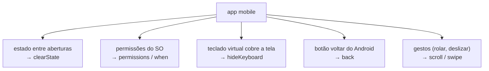

# Tutorial 32 — E2E Mobile com Maestro

> Referência: Maestro — documentação oficial (maestro.mobile.dev); Martin Fowler, "TestPyramid" (martinfowler.com)

## 1. Contexto e Motivação

O Tutorial 31 usou o Maestro contra uma aplicação web real e, no caminho, apresentou os recursos que valem para qualquer plataforma: o flow em YAML, o seletor estável, a assertion no lugar da espera fixa, o subflow reutilizável com `runFlow`, a parametrização com `env`, a rolagem com `scrollUntilVisible` e a asserção de estado derivado. Este tutorial leva a mesma ferramenta ao mobile, e o foco é o que muda quando o alvo deixa de ser uma página no navegador e passa a ser um app instalado em um aparelho.

O alvo aqui é o **Sauce Labs My Demo App**, o equivalente mobile do saucedemo: um aplicativo React Native de loja, com login, catálogo, carrinho e checkout, publicado pela Sauce Labs justamente para praticar automação. O `appId` dele é `com.saucelabs.mydemoapp.rn`. Ao contrário do alvo web, um app mobile não roda "na internet": ele precisa estar instalado em um emulador Android ou simulador iOS. Este tutorial não empacota o app — construir e distribuir um binário está fora do escopo —, mas os flows são escritos contra esse app real e conhecido, e a seção 3 explica como obtê-lo.

O que o mobile acrescenta são cinco fontes de instabilidade que a web não tem, e cada uma exige um cuidado próprio no flow:



Uma página web recarrega do zero a cada abertura e não pede permissão de câmera nem tem botão físico de voltar. O app, sim — e cada um desses pontos é uma fonte de falha que o flow precisa tratar de propósito.

---

## 2. Conceito Central

### (a) Estado entre execuções: `clearState` e `stopApp`

O `launchApp`, sozinho, abre o app no estado em que ele ficou. Se a execução anterior terminou logada, a próxima começa logada. O resultado passa a depender do que sobrou, não do que o flow faz — a forma mais frustrante de um teste falhar. Uma página web recarrega do zero a cada abertura; um app mobile, não.

A solução é reiniciar o estado no início. O `launchApp` aceita `clearState`, que apaga os dados do app (sessão, cache, dados locais) antes de abrir, deixando-o como numa instalação recém-feita:

```yaml
# ❌ Abre no estado que sobrou — pode começar logado
- launchApp

# ✅ Zera os dados antes de abrir — começa sempre deslogado
- launchApp:
    clearState: true
```

Existe também `stopApp`, que encerra o processo sem apagar os dados — útil para simular o usuário fechando e reabrindo o app no meio de um cenário.

> **Nota:** `clearState` e `stopApp` são fáceis de confundir, e a diferença importa. `clearState` **apaga os dados** (você volta à instalação limpa: deslogado, carrinho vazio). `stopApp` **só encerra o processo** e o mantém desligado até o próximo `launchApp` — os dados continuam lá. Use `clearState` para garantir um ponto de partida limpo; use `stopApp` quando o cenário é justamente "o usuário fechou o app e voltou", e você quer que a sessão anterior continue.

### (b) O login reutilizável, no mobile (`runFlow` + `env`)

O raciocínio do Tutorial 31 vale igual aqui: como quase todo fluxo começa pelo login, ele vive em um subflow — o [`exemplos/login.yaml`](exemplos/login.yaml) — chamado com `runFlow`, e recebe o usuário por parâmetro com `env`:

```yaml
- runFlow:
    file: login.yaml
    env:
      USUARIO: "bob@example.com"
```

A diferença em relação à web está no tamanho do subflow. No navegador, a tela de login já era a primeira coisa que aparecia. No app, é preciso navegar até ela primeiro — abrir o menu, escolher "Log In" — e ainda lidar com o teclado. Por isso o `login.yaml` mobile carrega mais passos:

```yaml
# exemplos/login.yaml — o subflow de login mobile, com navegação e teclado
appId: com.saucelabs.mydemoapp.rn
env:
  USUARIO: "bob@example.com"
---
- launchApp:
    clearState: true          # começa deslogado a cada execução
- tapOn: "Open menu"
- tapOn: "Log In"
- tapOn:
    id: "Username input field"
- inputText: "${USUARIO}"
- tapOn:
    id: "Password input field"
- inputText: "10203040"
- hideKeyboard               # fecha o teclado antes de tocar no botão
- tapOn:
    id: "Login button"
- assertVisible: "Products"   # confirma que o login levou ao catálogo
```

Concentrar essa navegação em um arquivo evita repeti-la em cada teste — e no dia em que o app mudar o caminho até o login, corrige-se um lugar só.

### (c) Permissões e telas de abertura: condicionais (`when`)

Um app mobile costuma pedir permissões — localização, câmera, notificações — em um diálogo do próprio sistema, que aparece por cima da interface. Há duas formas de lidar com isso.

A primeira é declarar as permissões no `launchApp`, o que as responde sem depender do diálogo aparecer:

```yaml
- launchApp:
    clearState: true
    permissions:
      location: allow
```

A segunda é a condicional `when`, para o que é opcional e não é uma permissão do sistema — uma tela de boas-vindas que só surge na primeira execução, um aviso que aparece às vezes. Um passo incondicional que tenta fechar uma tela ausente faz o flow falhar; a condicional só executa o trecho quando o elemento está presente:

```yaml
# Só fecha a tela de boas-vindas se ela estiver visível
- runFlow:
    when:
      visible: "Pular introdução"
    commands:
      - tapOn: "Pular introdução"
```

> **Atenção:** a distinção entre os dois casos é prática. Permissão do sistema (o diálogo cinza do Android/iOS pedindo acesso a algo) resolve-se com `permissions` no `launchApp`, porque o `when` nem sempre alcança elementos desenhados pelo SO, e não pela sua interface. Tela da sua aplicação que aparece de vez em quando (boas-vindas, promoção, aviso) resolve-se com `when`. Trocar um pelo outro é uma causa comum de flow instável.

### (d) Gestos e listas: `scroll`, `swipe` e `scrollUntilVisible`

Na web, quase tudo era tocar. No mobile, boa parte do conteúdo só aparece depois de rolar, e algumas ações se fazem por gesto. O `swipe` executa um deslize entre dois pontos (descartar um card, avançar um carrossel). Para alcançar um item numa lista longa, vale a mesma lição da espera: rolar uma quantidade fixa depende do tamanho do aparelho, então o certo é rolar *até a condição*, com `scrollUntilVisible`. O [`exemplos/fluxo_bons.yaml`](exemplos/fluxo_bons.yaml) usa isso para chegar ao produto:

```yaml
# Rola a lista de produtos até o item aparecer, e só então para
- scrollUntilVisible:
    element:
      text: "Sauce Labs Backpack"
    direction: DOWN
- tapOn: "Sauce Labs Backpack"
```

### (e) Quando há vários elementos iguais: o seletor por `index`

A grade de produtos tem vários botões "Add To Cart" idênticos — um por produto. Um seletor por esse texto encontra mais de um elemento, e o Maestro não sabe em qual tocar. Duas saídas: navegar por algo único (o nome do produto, como acima) ou desambiguar pela posição entre os elementos que casam, com `index` (contado a partir de zero):

```yaml
# Toca no segundo botão "Add To Cart" da tela (índice 1)
- tapOn:
    text: "Add To Cart"
    index: 1
```

> **Dica:** o `index` é o último recurso, não o primeiro. Ele depende da ordem na tela, então quebra quando a lista muda de ordem ou ganha um item novo no começo. Sempre que existir um seletor único — um `id`, ou o nome do produto — prefira-o. Deixe o `index` para o caso em que não há nada que distinga um elemento do outro além da posição.

### (f) O botão "voltar" e o teclado

Duas particularidades aparecem o tempo todo. O botão "voltar" do Android é acionado pelo comando `back` — não tem equivalente no iOS nem na web, e muitos apps o usam para fechar telas. E o teclado virtual: ao usar `inputText` num campo, o teclado sobe e pode cobrir o botão do próximo passo. O `hideKeyboard` o fecha antes de seguir — é por isso que ele aparece no `login.yaml`, entre a senha e o botão de entrar.

> **Atenção:** o teclado que não foi fechado é uma das falhas mais confusas de diagnosticar. O flow toca em `inputText`, o teclado sobe, e o `tapOn` seguinte tenta alcançar um botão que agora está coberto — o toque cai na tecla do teclado, não no botão. O fluxo falha com uma mensagem que não aponta para o teclado. A regra: depois de digitar, se o próximo passo é tocar em algo na parte de baixo da tela, feche o teclado com `hideKeyboard`.

### (g) Verificar estado, não cliques

Como na web, a verificação que dá confiança olha o efeito da ação, não o toque. No My Demo App, ao adicionar um produto, o botão "Add To Cart" da tela do item vira "Remove Item". Confirmar essa troca prova que o item entrou:

```yaml
- tapOn: "Add To Cart"
- assertVisible: "Remove Item"
```

### (h) Diferenças entre iOS e Android

O mesmo flow roda nas duas plataformas, mas nem tudo se comporta igual. O `back` existe no Android e não no iOS. Os diálogos de permissão têm textos e botões diferentes em cada sistema. A árvore de elementos — de onde saem os `id` e textos dos seletores — pode variar entre as duas, porque quem construiu o app pode ter nomeado as coisas de forma diferente. Um flow para ambos se apoia em seletores presentes nos dois, e o `maestro studio` (seção 3) mostra quais são em cada aparelho.

### (i) Referência rápida: o que o mobile acrescenta

Os comandos e recursos que aparecem só no mobile (ou pesam mais aqui que na web):

| Comando / recurso | Para que serve | Cuidado |
|---|---|---|
| `launchApp: clearState` | zera os dados antes de abrir | sem ele, começa no estado que sobrou |
| `stopApp` | encerra o processo, sem apagar dados | não confundir com `clearState` |
| `permissions` | responde diálogos do SO no `launchApp` | para permissão do sistema, não use `when` |
| `hideKeyboard` | fecha o teclado virtual | depois de `inputText`, antes de tocar embaixo |
| `back` | botão voltar do Android | não existe no iOS |
| `swipe` | deslize entre dois pontos | descartar card, avançar carrossel |
| `tapOn: index` | desambigua elementos iguais | último recurso; depende da ordem |

---

## 3. Ferramentas Modernas por Linguagem

Como no Tutorial 31, os flows são escritos em **YAML**, a linguagem nativa da ferramenta — não há versão em Python, PHP, TypeScript ou ADVPL/TLPP, e por isso não há arquivos `equivalente.*`. O material vive nos YAML de `exemplos/`.

**Pré-requisitos para executar os flows:**

- O Maestro instalado, na **versão estável** (linha 2.x) — o passo a passo por sistema operacional (macOS, Linux e Windows) está no [Tutorial 31, seção 3](../tutorial-31-e2e-web-maestro/README.md#3-ferramentas-modernas-por-linguagem-instalar-e-rodar-o-maestro-do-zero). Em resumo: `curl -fsSL "https://get.maestro.mobile.dev" | bash` no macOS/Linux, ou o `maestro.zip` nativo no Windows. O pré-requisito comum é o Java 17+.
- Um emulador Android ou simulador iOS em execução.
- O **Sauce Labs My Demo App** instalado nesse emulador. O binário (`.apk` para Android, `.app`/`.ipa` para iOS) está disponível no repositório público da Sauce Labs no GitHub (`saucelabs/my-demo-app-rn`, na seção de releases). Instale-o no emulador antes de rodar os flows.

**Rodar um flow:**

```bash
maestro test sessao-9/tutorial-32-e2e-mobile-maestro/exemplos/fluxo_bons.yaml
```

**Descobrir os seletores da tela atual:**

```bash
maestro studio
```

> **Dica:** o `maestro studio` é indispensável no mobile, mais até que na web. Os identificadores de acessibilidade de um app React Native variam por versão e por plataforma, então os seletores usados nestes flows (`Username input field`, `Add To Cart`, `Remove Item`, etc.) devem ser conferidos com o `studio` no seu ambiente antes de fixá-los. Abra o app no emulador, rode o `studio` e clique nos elementos para ver os seletores que cada um aceita naquele aparelho.

> **Nota:** o workshop pressupõe que **você** instale o Maestro (a versão estável, linha 2.x), suba um emulador ou simulador com o app-alvo e rode os flows na sua máquina — é assim que se pratica E2E mobile. Durante a escrita deste material, os flows foram conferidos por validação estrutural do YAML e comandos reais da ferramenta, não executados contra um emulador; o que vale é o resultado quando você rodar. Diferente do alvo web (que usa `url:`), um app mobile é identificado por `appId:` — aqui, `com.saucelabs.mydemoapp.rn`.

---

## 4. Exercício

O arquivo [`exercicios/exercicio.yaml`](exercicios/exercicio.yaml) começa mal um fluxo de compra no My Demo App: abre o app sem `clearState`, presume uma sessão anterior, toca por coordenada e não confirma nada. O objetivo é reescrevê-lo para começar do zero e chegar, de forma confiável, a um item no carrinho.

**Etapas:**

1. Troque a abertura por `runFlow` do subflow [`exercicios/login.yaml`](exercicios/login.yaml) (que já inclui `clearState`), começando sempre deslogado.
2. Alcance o produto com `scrollUntilVisible` e toque nele pelo texto (`Sauce Labs Backpack`), em vez de coordenadas.
3. Adicione ao carrinho e confirme pelo estado derivado (`Remove Item`).
4. Descubra os seletores exatos com `maestro studio` e compare com [`exercicios/gabarito.yaml`](exercicios/gabarito.yaml).

```bash
# Validar a estrutura YAML (não substitui rodar com o Maestro instalado)
python3 -c "import yaml; list(yaml.safe_load_all(open('sessao-9/tutorial-32-e2e-mobile-maestro/exercicios/gabarito.yaml')))"
```

> **Dica:** ao trocar a abertura pelo subflow de login, repare que o `clearState` já está lá dentro — não o repita no fluxo que chama. Um dos ganhos de concentrar o login no subflow é que o ponto de partida limpo vem junto, de graça, para todo flow que o invoca.

---

## 5. Checklist

- [ ] O flow começa de um estado limpo (`launchApp: clearState: true`, no subflow de login), sem depender de sessão ou dados de execuções anteriores?
- [ ] O login está em um subflow reutilizável (`login.yaml`) chamado por `runFlow`, com o usuário vindo por parâmetro (`env`)?
- [ ] As permissões do sistema são declaradas no `launchApp`, e as telas opcionais (boas-vindas, avisos) são tratadas com uma condicional (`when`)?
- [ ] Itens fora da tela são alcançados com `scrollUntilVisible`, em vez de rolagem de tamanho fixo ou coordenada?
- [ ] Quando há vários elementos iguais, o flow desambigua por um seletor único (nome, `id`) ou, faltando esse, por `index`?
- [ ] O teclado é fechado com `hideKeyboard` quando pode cobrir o próximo elemento?
- [ ] Os seletores existem tanto no Android quanto no iOS, se o objetivo é rodar nas duas plataformas?
- [ ] Cada ação relevante termina com uma assertion sobre o estado derivado (`Remove Item`, o contador do carrinho), não apenas sobre o toque?

---

## 6. Referências

- **Maestro.** Documentação oficial.
  `https://maestro.mobile.dev`
  Referência dos comandos usados aqui — `launchApp` (com `clearState` e `permissions`), `runFlow` (com `file`, `env`, `when`), `scrollUntilVisible`, `swipe`, `scroll`, `back`, `hideKeyboard`, `stopApp`, `tapOn` com `index` — e do `maestro studio`.

- **Sauce Labs.** My Demo App (React Native) — `saucelabs/my-demo-app-rn` (GitHub).
  O app de demonstração usado como alvo, com login, catálogo, carrinho e checkout; equivalente mobile do saucedemo do Tutorial 31.

- **FOWLER, Martin.** "TestPyramid" (bliki).
  `https://martinfowler.com/bliki/TestPyramid.html`
  A pirâmide, já usada na Sessão 7 e no Tutorial 31 — o E2E mobile é tão caro e lento quanto o web, e fica no mesmo topo raro.
