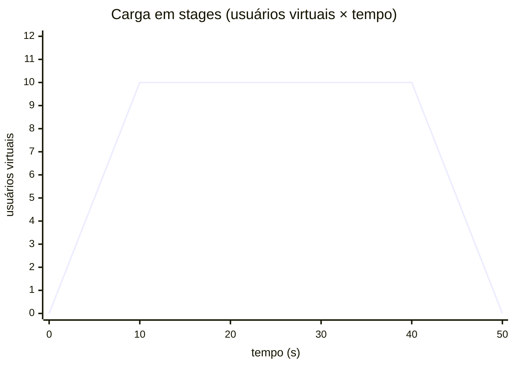
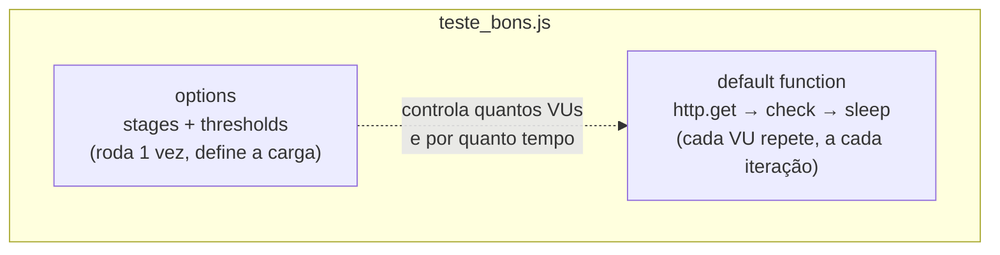

# Tutorial 33 — Testes de Performance com K6 ⭐ (âncora da Sessão 9)

> Referência: k6 — documentação oficial (grafana.com/docs/k6); Martin Fowler, "TestPyramid" (martinfowler.com)

## 1. Contexto e Motivação

Todos os testes deste workshop até agora responderam à mesma pergunta, em níveis diferentes: o sistema faz a coisa certa? O teste de unidade responde por uma função, o de integração por uma colaboração, o de E2E pelo fluxo que o usuário percorre. Um teste de performance responde a uma pergunta de natureza diferente: o sistema continua fazendo a coisa certa, e rápido o suficiente, quando muitos usuários o acessam ao mesmo tempo?

Essa pergunta não aparece nos outros andares da pirâmide, porque todos eles rodam com um usuário de cada vez. Uma API pode passar em todos os testes de integração e ainda assim ficar lenta, ou começar a devolver erros, quando mil pessoas fazem pedidos simultaneamente — o banco satura, um pool de conexões se esgota, a memória acaba. Nada disso se manifesta com uma requisição por vez. Só aparece sob carga, e é justamente a carga que um teste de performance aplica de propósito, para medir o que acontece.

Há vários tipos de teste de performance, e eles se distinguem pelo formato da carga que aplicam:

| Tipo | Carga aplicada | Pergunta que responde |
|---|---|---|
| **Smoke** | mínima (1–2 usuários) | o teste e o alvo funcionam? |
| **Load** | a esperada em produção | o comportamento no dia a dia é aceitável? |
| **Stress** | acima do esperado | onde o sistema começa a quebrar? |
| **Soak** | a esperada, por muito tempo | há vazamento que só surge com horas de uso? |
| **Spike** | pico repentino | como o sistema reage e se recupera de um susto? |

Este tutorial se concentra no **load test**, que é o ponto de partida mais útil, mas os conceitos valem para todos.

A ferramenta é o **K6**, da Grafana. Os testes são escritos em JavaScript, e o alvo é uma API de pedidos mínima em [`exemplos/alvo/servidor.py`](exemplos/alvo/servidor.py), escrita com a biblioteca padrão do Python e com uma latência artificial de 20 ms por requisição, para que haja algo concreto para medir:

```python
# exemplos/alvo/servidor.py — a latência artificial dá ao teste o que medir
def do_GET(self):
    time.sleep(0.02)  # 20 ms de latência de propósito
    if self.path == "/pedidos":
        self._responder(200, _pedidos)
```

> **Nota:** o alvo é de brinquedo — um servidor de biblioteca padrão, com 20 ms fixos de atraso — porque o objeto do tutorial é o teste de carga, não o sistema testado. Contra uma API real, os mesmos scripts do K6 mediriam o comportamento de verdade: a latência que sobe quando o banco satura, os erros que aparecem quando o pool de conexões esgota. O `time.sleep(0.02)` só garante que o `p(95)` tenha um número diferente de zero para observar.

---

## 2. Conceito Central

### (a) Usuários virtuais e iterações

O K6 aplica carga por meio de **usuários virtuais**: threads independentes que executam, cada uma, a função de teste em repetição. Dez usuários virtuais são dez cópias do fluxo rodando em paralelo, cada uma fazendo requisições uma após a outra. Cada volta completa da função é uma **iteração**. O número de usuários virtuais determina a intensidade da carga; o número de iterações que eles conseguem completar num intervalo determina a vazão que o alvo suportou.

> **Nota:** o K6 chama os usuários virtuais de "VUs" (virtual users), e você verá essa sigla no relatório e na documentação. Não confunda usuário virtual com iteração: o usuário virtual é o *trabalhador* (uma thread que repete o fluxo); a iteração é uma *volta* que ele deu. Cinco usuários virtuais que dão vinte voltas cada produzem cem iterações. É a iteração que vira uma unidade de vazão; o usuário virtual é o que gera a pressão.

### (b) Ramp-up com stages: por que não disparar tudo de uma vez

A forma como a carga entra importa tanto quanto o seu tamanho. Subir de zero para cinquenta usuários instantaneamente não corresponde a nada que aconteça em produção, onde o tráfego cresce ao longo de minutos ou horas. Um pico seco na largada mede principalmente como o sistema reage ao susto, e não como ele se comporta no regime sustentado que interessa.

Os **stages** descrevem a carga como uma sequência de rampas. Cada stage tem uma duração e um alvo de usuários virtuais, e o K6 interpola linearmente entre um e o próximo. Uma configuração típica de load test sobe a carga aos poucos (ramp-up), sustenta no nível desejado por um tempo, e desce de volta a zero (ramp-down). A curva de carga do [`exemplos/teste_bons.js`](exemplos/teste_bons.js) tem esta forma — sobe em 10 s, sustenta 30 s, desce em 10 s:



Em YAML de opções, essa mesma curva são três stages:

```javascript
export const options = {
  stages: [
    { duration: '10s', target: 10 }, // ramp-up: de 0 a 10 usuários
    { duration: '30s', target: 10 }, // carga sustentada em 10
    { duration: '10s', target: 0 },  // ramp-down: volta a 0
  ],
};
```

### (c) Thresholds: o SLO versionado junto do teste

Um teste de carga que só gera tráfego produz números, mas não um veredito. É preciso definir o que conta como aprovado, e é isso que os **thresholds** fazem. Um threshold é uma condição sobre uma métrica que, se não for cumprida, faz o K6 encerrar com código de saída diferente de zero — o que reprova o job num pipeline de CI, do mesmo modo que um teste de unidade que falha.

O valor dos thresholds é que eles transformam um objetivo de nível de serviço (o SLO) em código versionado, revisável e executável. "95% das requisições devem responder em menos de 500 ms" deixa de ser uma frase num documento e passa a ser uma linha que o CI verifica a cada mudança:

```javascript
thresholds: {
  http_req_duration: ['p(95)<500'], // 95% das requisições abaixo de 500 ms
  http_req_failed: ['rate<0.01'],   // menos de 1% de falhas
},
```

> **Nota:** SLO é o objetivo de nível de serviço — a meta acordada de quão rápido e quão confiável o sistema deve ser ("95% em menos de 500 ms", "menos de 1% de erro"). O threshold é onde esse acordo deixa de viver num documento e passa a ser verificado por máquina, a cada mudança de código. Se ninguém escreveu o SLO como threshold, o teste de carga mede, mas não julga — e alguém precisa ler o relatório à mão para decidir se passou.

### (d) Checks e thresholds: verificações diferentes

`check` e `threshold` são fáceis de confundir, e fazem coisas distintas. Um **check** valida uma resposta individual — o status foi 200? o corpo é a lista esperada? — e registra a proporção de acertos. Um check que falha não reprova o teste sozinho; ele revela que, sob carga, a aplicação passou a responder errado, algo que a latência sozinha não mostraria.

```javascript
check(res, {
  'status é 200': (r) => r.status === 200,
  'corpo é uma lista de pedidos': (r) => Array.isArray(r.json()),
});
```

Um **threshold**, por outro lado, é o critério de aprovação do teste como um todo, aplicado sobre uma métrica agregada. A tabela resume a diferença:

| | `check` | `threshold` |
|---|---|---|
| Olha | uma resposta por vez | uma métrica agregada de todas |
| Falhar sozinho reprova? | não (só registra a taxa) | sim (encerra com erro) |
| Responde | a app respondeu certo? | o conjunto cumpriu o SLO? |

> **Dica:** a relação prática entre os dois fecha o ciclo: dá para promover a taxa de sucesso de um check a threshold, exigindo, por exemplo, que pelo menos 99% dos checks passem para o teste ser aprovado (`checks: ['rate>0.99']`). Assim o check deixa de ser só um registro e vira também critério de reprovação — a app responder errado sob carga passa a derrubar o job, não só a aparecer no relatório.

### (e) As métricas que importam: percentis, não média

O K6 coleta métricas automaticamente, e duas concentram a maior parte das decisões:

| Métrica | O que mede | O número a observar |
|---|---|---|
| `http_req_duration` | tempo de resposta | `p(95)`, `p(99)` — quase nunca a média |
| `http_req_failed` | proporção de requisições que falharam | a taxa (`rate`) |

`http_req_duration` mede o tempo de resposta, e o número a observar quase nunca é a média. A média esconde os piores casos: um sistema com média de 100 ms pode estar entregando 2 segundos para uma fração dos usuários, e são esses que reclamam. Por isso se olha o **percentil** — `p(95)` é o tempo abaixo do qual 95% das requisições responderam, e `p(99)` estende isso para 99%. A outra métrica é `http_req_failed`, a proporção de requisições que falharam, que responde à pergunta complementar: quanto do que o sistema entregou sob carga estava correto?

> **Atenção:** a média é a métrica que engana. Imagine cem requisições: noventa e cinco respondem em 50 ms e cinco respondem em 3 segundos. A média dá ~200 ms, um número que parece saudável e não corresponde à experiência de ninguém — os cinco usuários lentos esperaram 3 segundos, e é deles que vem a reclamação. O `p(95)` mostra 50 ms; o `p(99)`, os 3 segundos. É por isso que um SLO se escreve em percentil, nunca em média.

### (f) A anatomia de um script K6

Um script K6 tem duas partes, e vale separá-las na cabeça. O bloco `options` descreve *a forma da carga e o critério de aprovação* — roda uma vez, no começo. A `default function` descreve *o que cada usuário virtual faz em cada iteração* — roda em repetição, por cada VU, do início ao fim do teste:



O [`exemplos/teste_bons.js`](exemplos/teste_bons.js) inteiro cabe nessa divisão — `options` no topo, `default function` embaixo:

```javascript
import http from 'k6/http';
import { check, sleep } from 'k6';

export const options = {
  stages: [ /* ramp-up, sustentado, ramp-down */ ],
  thresholds: { /* o SLO como código */ },
};

export default function () {
  const res = http.get('http://localhost:8000/pedidos');
  check(res, {
    'status é 200': (r) => r.status === 200,
    'corpo é uma lista de pedidos': (r) => Array.isArray(r.json()),
  });
  sleep(1); // pausa entre iterações, aproximando o ritmo de um usuário real
}
```

O `sleep(1)` no fim não é desperdício: ele aproxima o ritmo de um usuário real, que não dispara requisições sem pausa. Sem ele, cada usuário virtual martelaria o alvo tão rápido quanto a máquina permitisse, medindo a saturação do cliente em vez do comportamento realista sob carga.

---

## 3. Ferramentas Modernas por Linguagem

Os testes do K6 são escritos em **JavaScript**, e essa é a linguagem nativa da ferramenta — o K6 executa os scripts em um runtime JavaScript próprio, não no Node. Não há uma versão desses testes em Python, PHP ou ADVPL/TLPP: como no Maestro dos tutoriais anteriores, a linguagem é da ferramenta, não uma escolha deste workshop. Por isso o tutorial não traz arquivos `equivalente.*`; o par bom/ruim vive nos dois arquivos `.js` de `exemplos/`.

> **Nota:** o K6 roda os scripts num runtime JavaScript próprio (o goja, embarcado no binário Go da ferramenta), e não no Node. Na prática isso significa que módulos de Node (`fs`, `path`, pacotes de `npm`) não estão disponíveis — só a API que o K6 expõe, como `k6/http` e `k6`. O `import http from 'k6/http'` no topo do script é dessa API, não de um pacote instalado.

**Instalar o k6** — a **versão estável** (linha 2.x); a API de script usada aqui (`stages`, `thresholds`, `check`, `k6/http`) é estável entre versões:

```bash
brew install k6                      # macOS
# ou baixe o binário em grafana.com/docs/k6
```

**Subir o alvo** deste tutorial, num terminal:

```bash
python3 sessao-9/tutorial-33-performance-k6/exemplos/alvo/servidor.py
```

**Rodar um teste de carga**, com o alvo ativo em outro terminal:

```bash
k6 run sessao-9/tutorial-33-performance-k6/exemplos/teste_bons.js
```

Ao final, o K6 imprime um resumo com as métricas coletadas e o resultado de cada threshold, marcado com um sinal de aprovado ou reprovado. Quando um threshold é reprovado, o comando encerra com código diferente de zero, e é assim que ele integra a um pipeline: o job de performance falha por conta própria, sem ninguém precisar ler o relatório para decidir.

> **Nota:** o workshop pressupõe que **você** instale o k6 (a versão estável, linha 2.x) e suba o alvo local para rodar os scripts — é assim que se mede carga. Durante a escrita deste material, os scripts foram conferidos quanto à sintaxe JavaScript, não executados contra o alvo; como a API usada é estável entre versões, o que vale é o relatório que o k6 imprimir quando você rodar.

---

## 4. Exercício

O arquivo [`exercicios/exercicio.js`](exercicios/exercicio.js) exercita a rota `POST /pedidos` sob carga, mas escrito como um simples gerador de tráfego: dispara todos os usuários de uma vez, não define nenhum critério de aprovação e não valida as respostas. Ele roda, produz números e não testa nada — passa em qualquer cenário.

**Etapas:**

1. Troque `vus`/`duration` por `stages`, com uma rampa de subida, um trecho de carga sustentada e uma rampa de descida.
2. Adicione `thresholds` com um SLO: um percentil de `http_req_duration` e um limite para `http_req_failed`.
3. Adicione um `check` que valide o status `201` e o corpo da resposta da criação do pedido.
4. Compare o resultado com [`exercicios/gabarito.js`](exercicios/gabarito.js).

```bash
# Validar a sintaxe JavaScript de ambos (não substitui rodar com o k6 instalado)
node --check sessao-9/tutorial-33-performance-k6/exercicios/exercicio.js
node --check sessao-9/tutorial-33-performance-k6/exercicios/gabarito.js
```

> **Dica:** o `POST /pedidos` responde `201`, não `200` — o exercício muda a rota de propósito para você não copiar o check do exemplo cru. É a mesma disciplina do check da seção (d): valide o status certo *e* o corpo (o `id` que voltou), para provar que a criação funcionou sob carga, e não só que o servidor respondeu algo.

---

## 5. Checklist

- [ ] A carga sobe por `stages`, com ramp-up e ramp-down, em vez de um pico seco de usuários na largada?
- [ ] O teste define `thresholds` que expressam o SLO (percentil de latência e taxa de falhas), de modo que ele possa reprovar?
- [ ] Cada resposta é validada por um `check`, confirmando que a aplicação responde certo mesmo sob carga?
- [ ] As métricas observadas são percentis (`p(95)`, `p(99)`), e não a média, que esconde os piores casos?
- [ ] O teste é pensado para o CI — um threshold reprovado faz o comando encerrar com erro, sem depender de leitura manual do relatório?

---

## 6. Referências

- **k6 (Grafana).** Documentação oficial.
  `https://grafana.com/docs/k6/latest/`
  Referência de `options` (stages, thresholds), da API `k6/http`, de `check`, e da lista de métricas (`http_req_duration`, `http_req_failed` e as demais) usadas neste tutorial.

- **k6 (Grafana).** "Test types".
  `https://grafana.com/docs/k6/latest/testing-guides/test-types/`
  Detalha os tipos de teste de carga citados na seção 1 — smoke, load, stress, soak e spike — e quando usar cada um.

- **FOWLER, Martin.** "TestPyramid" (bliki).
  `https://martinfowler.com/bliki/TestPyramid.html`
  A pirâmide trata da correção funcional em camadas; o teste de performance é uma dimensão transversal, que pergunta não se o sistema funciona, e sim se ele aguenta a carga — um complemento à pirâmide, não um de seus andares.
